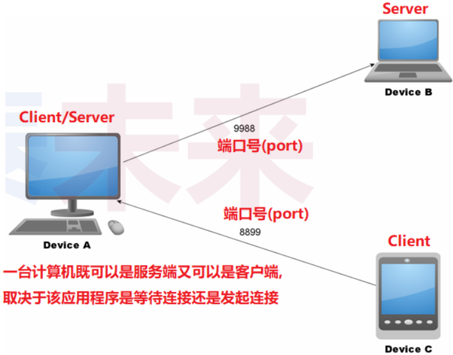
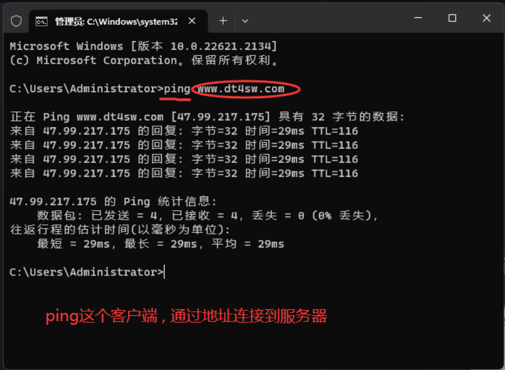

# 网络编程核心概念与模式

## 1.网络编程核心概念

> 问题：如何进行网络编程?

### 1.1 网络编程的本质

- 使用操作系统提供的`接口函数` , 使得应用程序`具备收发网络数据`的能力

 

- 网络接口在代码层面是操作系统提供的函数
  - 网络编程只是一系列`系统函数的花式玩法`

- 应用程序通过网络接口使用操作系统的联网能力
  - 网络编程是 `特定领域的语言程序设计`

### 1.2 网络编程核心概念

**（1）协议**

- 协议 : `为进行数据通信而预定义的数据规则`

**（2）地址**

- 地址 : 网络通信中的用于标识设备的`整数值整数值`(分段的4字节整型数)，就是常说的`IP`地址。例如 (`192.168.1.254`)

**（3）端口号**

- 设备为收发数据而`指定`的数值 , 用于标识具体连接。
- 可理解为 : 设备中用于网络通信的数据通道。

**（4）角色**

- 服务端(server) : 等待连接的设备
- 客户端(client) : 发起连接的设备

 

### 1.3网络连接实验

 

 