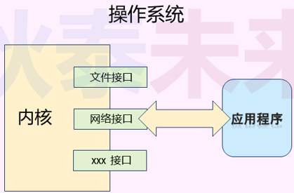

# 网络编程核心概念与模式

## 1.网络编程核心概念

> 问题：如何进行网络编程?

### 1.1 网络编程的本质

- 使用操作系统提供的`接口函数` , 使得应用程序`具备收发网络数据`的能力

 

- 网络接口在代码层面是操作系统提供的函数
  - 网络编程只是一系列`系统函数的花式玩法`

- 应用程序通过网络接口使用操作系统的联网能力
  - 网络编程是 `特定领域的语言程序设计`

### 1.2 网络编程核心概念