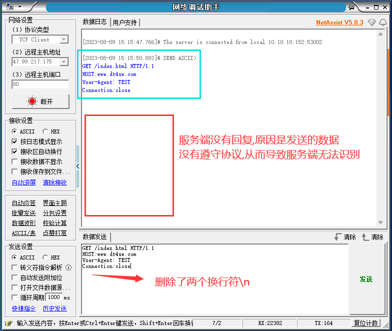

# 网络编程核心概念与模式

## 1.网络编程核心概念

> 问题：如何进行网络编程?

### 1.1 网络编程的本质

- 使用操作系统提供的`接口函数` , 使得应用程序`具备收发网络数据`的能力

 

- 网络接口在代码层面是操作系统提供的函数
  - 网络编程只是一系列`系统函数的花式玩法`

- 应用程序通过网络接口使用操作系统的联网能力
  - 网络编程是 `特定领域的语言程序设计`

------

### 1.2 网络编程核心概念

**（1）协议**

- 协议 : `为进行数据通信而预定义的数据规则`

**（2）地址**

- 地址 : 网络通信中的用于标识设备的`整数值整数值`(分段的4字节整型数)，就是常说的`IP`地址。例如 (`192.168.1.254`)

**（3）端口号**

- 设备为收发数据而`指定`的数值 , 用于标识具体连接。
- 可理解为 : 设备中用于网络通信的数据通道。

**（4）角色**

- 服务端(server) : 等待连接的设备
- 客户端(client) : 发起连接的设备

 

------

### 1.3 网络连接实验

 

 

 

 

------

### 1.4 网络知识充电站

**网络就是 `IP` 地址吗 ? `URL` 是什么 , 域名又是什么 ?**

- 网址不是 `IP地址` , 是 `网络信息资源` 的地址 ( 如 : 具体网页的地址 ) 即 `URL` 。
- `域名` 是 `IP` 地址的 `别名` , 多个域名可指向同一个 `IP` 地址。( 通过 `dns` 服务器转换 , 其实就是一个查询 )


**协议一定是看不懂的二进制数据吗 ?**

- `协议是一种约定协议是一种约定` , 即 : 预先定义的规则。
- 协议可以基于 `文本` 定义 , 也可以基于 `二进制` 定义。


**小端系统**

- 采用小端模式 (`little-endian`) 的系统 , 即 : 数据`低`字节放在内存`低`地址中。

  - 例如 : 一个整型数据 (`int`) `0x12345678` (12是高字节 , 78是低字节)
  
| low address |  78  |  56  |  34  |  12  | hight address |
| :---------: | :--: | :--: | :--: | :--: | :-----------: |


**大端系统**

- 采用大端模式 (`big-endian`) 的系统 , 即 : 数据低字节放在内存高地址中
  - 例如 : 一个整型数据 (`int`) `0x12345678` (12是高字节 , 78是低字节)

| low address | 12   | 34   | 56   | 78   | hight address |
| :---------: | :--: | :--: | :--: | :--: | :-----------: |


**网络字节序**

- 网络字节顺序采用 **`大端模式`** , 所以 : **`在小端系统中需要做字节序转换`**

------

## 2.网络编程核心模式

### 2.1 网络编程模式

>1. 准备网络连接
>2. 连接远程设备
>3. 收发数据
>4. 关闭连接

 

------

### 2.2 初探网络编程接口

 

### 2.3 网络编程示例

 

### 2.4编程实验

[参考链接](https://github.com/XavierWong-maker/Linux_Network_Programming_Code/blob/master/1_stu_socket/first_socket.cpp)

```C++
#include <sys/socket.h>
#include <netinet/in.h>
#include <arpa/inet.h>
#include <unistd.h>
#include <iostream>
#include <string.h>

using namespace std;

int main(int argc, char const *argv[])
{
    int sock = 0;
    sock = socket(PF_INET, SOCK_STREAM, 0);

    if(-1 == sock){
        cout << "Socket error" << endl;
        return -1;
    }

    const char* ipAddrStr = "47.99.217.175";
    sockaddr_in addr {};
    
    /*inet_addr() 将有效字符串转换为32位二进制网络字节序的IPV4地址*/
    //addr.sin_addr.s_addr = inet_addr("47.99.217.175");

    if(!inet_pton(AF_INET, ipAddrStr, &addr.sin_addr)){
        cout << "Invalid address" << endl;
        return -1;
    }

    /*htons() 把本机字节序转换成网络字节序*/
    addr.sin_port = htons(80);

    if(-1 == connect(sock, reinterpret_cast<sockaddr*> (&addr), sizeof(addr))){
        cout << "connect error" << endl;
        return -1;
    }

    cout << "connect success" << endl;

    constexpr char tosend[]  {"GET /index.html HTTP/1.1\nHOST:www.dt4sw.com\nUser-Agent:TEST\nConnection:close\n\n"};
    int len(send(sock, tosend, strlen(tosend), 0));
    cout << "send bytes :" << len << endl;

    len = 0;

    int r{};
    do
    {
        char buf[128]{};
        r = recv(sock, buf, sizeof(buf)/sizeof(*buf), 0);

        if(r > 0){
            len += r;
            for (int i = 0; i < r; i++)
            {
                cout << buf[i];
            }
        }
        
    } while (r > 0);
    
    cout << "\nrecv len = " << len << endl;

    close(sock);

    return 0;
}
```

 

 
