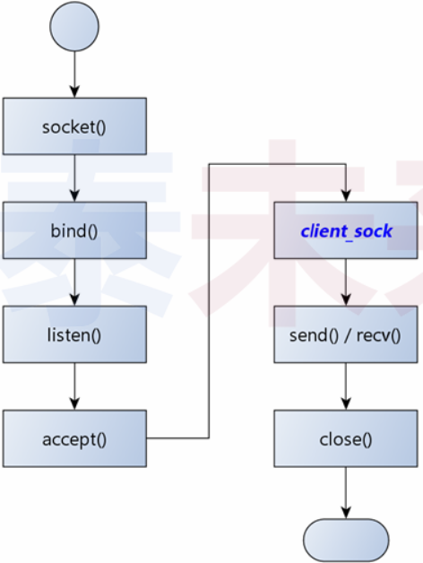
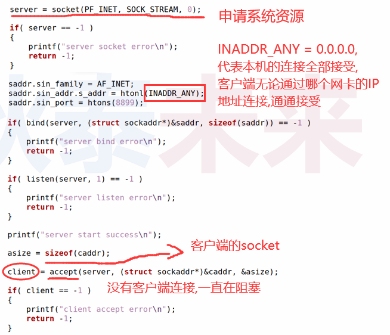
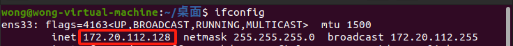
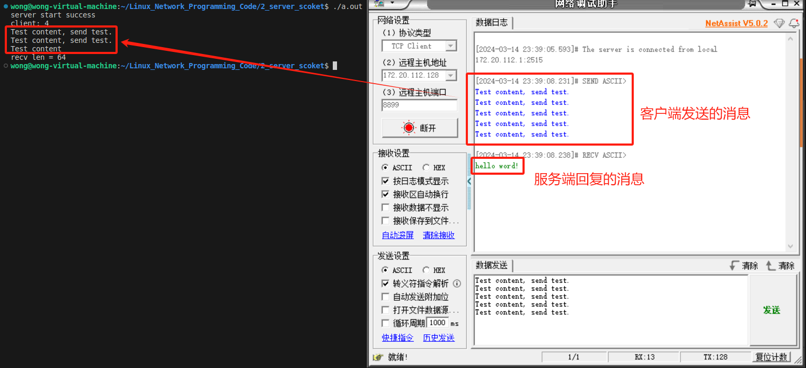
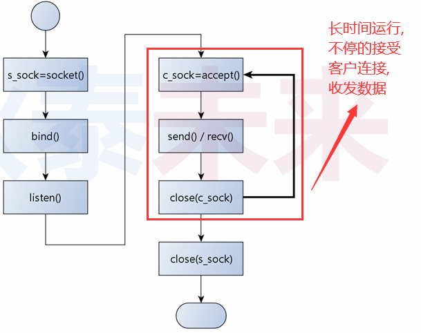
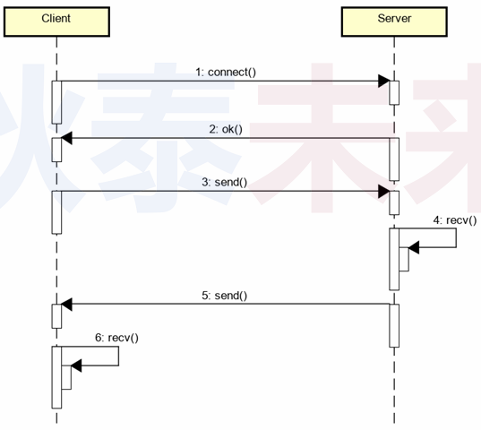
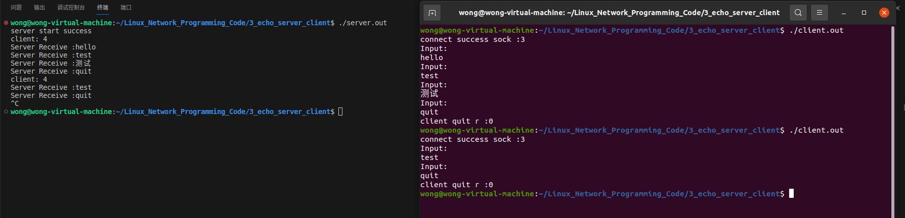

# 服务端编程初体验

问题 : 上次课编写的网络程序是什么角色?

## 1.客户端/服务端(C/S模型) 编程模式

- `服务端长期暴露于网络` , 并等待客户端连接
- `客户端发起连接动作` , 并等待服务端回应
- 特点：
  - 服务端无法主动连接客户端
  - 客户端只能按照预定义的方式连接服务端

------

### 1.1 服务端编程模式

1. 准备网络连接
2. 绑定端口
3. 进入端口监听状态
4. 等待连接

 

------

### 1.2服务端核心工作：绑定 & 监听 & 接收

#### 1.2.1绑定

```c++
int bind(int sock,struct sockaddr *addr,socklen_t addrlen);
//addr是socket地址,里面包含(ip,port)的信息
```

#### 1.2.2监听

```C++
int listen(int sock,int backlog);
//backlog是队列长度，（可连接最多客户端数）
```

#### 1.2.3接受连接

```c++
int accept(int sock,struct sockaddr *addr,socklen_t * addrlen); //此函数是阻塞式
/*该函数的返回值是与客户端通讯的socket*/
/*addr是客户端的ip地址和port等信息*/
```

------

### 1.3 深度剖析服务端

- 服务端 `socket` 只用于 **接收连接** , 不进行 **实际通信** 
- 当接收到连接时 , `accept(...)` 函数返回与客户端通信的 `socket`
- 服务端 `socket` 产生用于通信的客户端 `socket`
- ❓所以 , `socket` 究竟是什么玩意 ? 如何理解 ?

------

### 1.4 深入理解 socket(...) 函数

#### 1.4.1 socket(...) 是什么 ？

- `socket(...)` 是一个 “多功能” 函数 , 用于提供通信能力

#### 1.4.2 socket(...) 返回的又是什么 ?

 - `socket(...)` 的返回值是用于通信的资源标识符

#### 1.4.3 socket(...) 还能做什么 ?

 - `socket(...)` 可提供不同类型的通信功能 (本地进程间通信)

------

### 1.5 服务端编程示例

 

### 1.6 编程实验 : 服务端编程

[参考链接](https://github.com/XavierWong-maker/Linux_Network_Programming_Code/blob/master/2_server_socket/server.cpp)

```C++
#include <sys/socket.h>
#include <netinet/in.h>
#include <arpa/inet.h>
#include <unistd.h>
#include <cstring>
#include <iostream>

using namespace std;

int main(int argc, char const *argv[])
{
    int server {socket(PF_INET, SOCK_STREAM, 0)};

    if(-1 == server){
        cout << "server socket error" << endl;
        return -1;
    }

    sockaddr_in saddr {};
    saddr.sin_family = AF_INET;
    saddr.sin_addr.s_addr = htonl(INADDR_ANY);//htonl函数把小端转换成大端（网络字节序采用大端）
    saddr.sin_port = htons(8899);

    if(-1 == bind(server, reinterpret_cast <sockaddr*> (&saddr), sizeof(saddr))){
        cout << "server error" << endl;
        return -1;
    }

    if(-1 == listen(server,1)){
        cout << "server listen error" << endl;
        return -1;
    }

    cout << "server start success" << endl;

    sockaddr_in caddr {};
    socklen_t asize {sizeof(caddr)};
    int client {accept(server,reinterpret_cast<sockaddr*> (&caddr), &asize)};

    if(-1 == client){
        cout << "client accept error\n";
       return -1;
    }

    cout << "client: " << client << endl;//client的数值表示系统资源的id

    int len {0};
    do
    {
        char buf[32]{};
        int r (recv(client, buf, sizeof(buf)/sizeof(*buf), 0));

        if(r > 0){
            len += r;
            for (int i = 0; i < r; i++)
            {
                cout << buf[i];
            }
        }
        
    } while (len < 64);

    cout << "\nrecv len = " << len << endl;
    constexpr char temp_str[] {"hello word!\n"};
    send(client, temp_str, sizeof(temp_str), 0);

    sleep(1);

    close(client);
    close(server);

    return 0;
}
```

 



### 1.7客户端 / 服务端 (C/S) 编程的核心模式

- 服务端`长时间运行`（**死循环**）接收客户端请求
- 客户端连接后向服务端发送请求（**协议数据**）

#### 1.7.1 流程图

 

#### 1.7.2交互顺序

 

------

## 2. 客户端 / 服务端 编程实验

### 2.1功能需求

1. 服务端 **持续监听** 客户端连接
2. 服务端被连接后 `echo` (返回相同数据) 客户端数据
3. 服务端接收到 `quit` 后断开连接
4. 客户端 **接收用户输入** 并发送到服务端

------

### 2.2 编程实验 : C/S编程

[参考链接](https://github.com/XavierWong-maker/Linux_Network_Programming_Code/tree/master/3_echo_server_client)

#### 2.2.1 服务端

```C++
#include <sys/socket.h>
#include <netinet/in.h>
#include <arpa/inet.h>
#include <unistd.h>
#include <cstring>
#include <iostream>
#include <functional>
#include <signal.h>

using namespace std;

static function<void(int, siginfo_t*, void*)> signal_func;

void signal_handler(const int sig, siginfo_t* info, void*){
    signal_func(sig, info, nullptr);
}

int main(int argc, char const *argv[])
{
    int server {socket(PF_INET, SOCK_STREAM, 0)};
    int client {-1};

    if(-1 == server){
        cout << "server socket error" << endl;
        return -1;
    }

    {
        /*此处跟网络无关,仅仅是为了ctrl+c终止程序销毁server,client*/
        struct sigaction sa{};
        sa.sa_flags = SA_RESTART | SA_SIGINFO;
        sa.sa_sigaction = signal_handler;

        signal_func = move([=](const int sig, siginfo_t* info, void*)mutable{
            constexpr char str[] {"\nexit\n"};
            write(1,str,sizeof(str));
            close(client);
            close(server);
            exit(0);
        });

        sigaction(SIGINT, &sa, nullptr);
    }

    sockaddr_in saddr {};
    saddr.sin_family = AF_INET;
    saddr.sin_addr.s_addr = htonl(INADDR_ANY);//htonl函数把小端转换成大端（网络字节序采用大端）
    saddr.sin_port = htons(8888);

    if(-1 == bind(server, reinterpret_cast <sockaddr*> (&saddr), sizeof(saddr))){
        cout << "server error" << endl;
        return -1;
    }

    if(-1 == listen(server,1)){
        cout << "server listen error" << endl;
        return -1;
    }

    cout << "server start success" << endl;

    for(;;){

        sockaddr_in caddr {};
        socklen_t asize {sizeof(caddr)};
        client = accept(server,reinterpret_cast<sockaddr*> (&caddr), &asize);

        if(-1 == client){
            cout << "client accept error\n";
        return -1;
        }

        cout << "client: " << client << endl;//client的数值表示系统资源的id

        int r {},len {};
        do
        {
            char buf[32]{};
            r = (recv(client, buf, sizeof(buf)/sizeof(*buf), 0));

            if(r > 0){
                
                cout << "Server Receive :" << buf << endl;

                if(strcmp(buf,"quit")){
                    len = send(client, buf, r, 0);
                }else{ /*0 == strcmp(...) 跳出do while , 客户端断开连接*/
                    break;
                }
            }
            
        } while (r > 0);

        close(client);
    }
    close(server);

    return 0;
}
```

#### 2.2.2  客户端

```C++
#include <sys/socket.h>
#include <netinet/in.h>
#include <arpa/inet.h>
#include <unistd.h>
#include <iostream>
#include <string.h>

using namespace std;

int main(int argc, char const *argv[])
{
    int sock = 0;
    sock = socket(PF_INET, SOCK_STREAM, 0);

    if(-1 == sock){
        cout << "Socket error" << endl;
        return -1;
    }

    const char* ipAddrStr = "127.0.0.1";
    sockaddr_in addr {};
    addr.sin_family = AF_INET;
    
    if(!inet_pton(AF_INET, ipAddrStr, &addr.sin_addr)){
        cout << "Invalid address" << endl;
        return -1;
    }

    addr.sin_port = htons(8888);

    if(-1 == connect(sock, reinterpret_cast<sockaddr*> (&addr), sizeof(addr))){
        cout << "connect error" << endl;
        return -1;
    }

    cout << "connect success sock :" << sock << endl;

    for(;;){

        char input[32]{},buf[128]{};
        
        cout << "Input: \n";

        cin >> input;

        int len (send(sock, input, strlen(input) + 1, 0));

        int r (recv(sock, buf, sizeof(buf), 0));

        if(r > 0){
            // cout << "Receive :" << buf << endl;
        }else{ /* 与服务端断开连接 recv(...) 返回 0 */
            cout << "client quit r :" << r << '\n';
            break;
        }
    }

    close(sock);

    return 0;
}
```

#### 2.2.3 实验结果



多次连接，服务器依然可以提供服务；

> 思考：如何增强服务端的能力 , 同时支持多个客户端 ?

