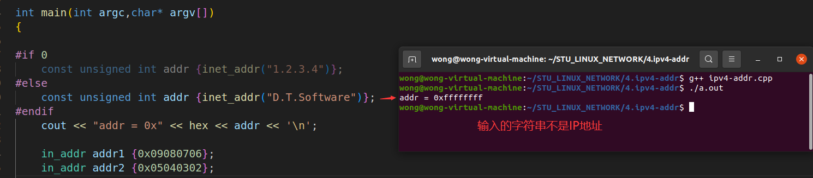
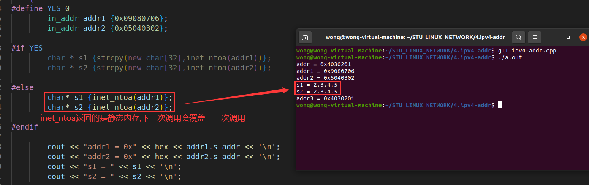

# 深入浅出IP地址

❓问题 : 网络编程接口中一些参数的意义是什么?


sock = socket(PF_INET,SOCK_STREAM,0)

## 1.再论 socket(...)

### 1.1 socket(...) 参数详解

 

#### 1.1.1 socket(...) 中的 domain 参数 (协议族)

`PF_INET`     -> IPV4 互联网协议族

`PF_INET6`   -> IPV6 互联网协议族

`PF_LOCAL`   -> 本地进程间通信协议族

`PF_PACKET` -> 底层数据收发协议族

`PF_IPX`       -> Novell专用协议 (互联网分组交换协议)

……

>⚠️注意：
>
>不同协议中的地址表现形式可能不同,
>网络编程时地址类型必须和协议类型匹配。

 

#### 1.1.2 socket(...) 中的 type 和 protocol

**type**

- 用于指定协议类型
  - SOCK_STREAM : 流式数据 (`TCP`)
  - SOCK_UGRAM : 报文式数据 (`UDP`)

**protocol**

- 用于指定协议族中符合类型的具体协议
  - domain 和 type `几乎可以唯一确定一种协议` , 因此 , 这个参数通常为 0。
  - 即 : 0 代表 domain 和 type 指定后的默认协议。

------

## 2.论IP地址

### 2.1 关于端口号 和 IP 地址

- (port) 端口号是一个2字节无符号数据
- 0~1023作为`特定端口`被预定义 (分配给特定应用程序)
  - 某些系统 1024~2048 也被预留了 , 在编程时强行使用可能出现bind(...)失败
  - 在选择的时候 , 尽量选择 **数值大一些** 的端口号 , 比如 : 8888 , 8899之类的
- IP 地址是一个4字节地址族 (可分为5类地址)

 

### 2.2 深入解析IP地址

- IP地址分为 `网络标识` 和 `主机标识` 两部分
  - 网络标识 : 标识网络主机 (设备) 所在的网络
  - 主机标识 : 标识网络主机 (设备) 的具体地址
- ❓问题 : 一个IP地址就4个字节,那么如何区分网络标识和主机标识呢 ?

 

 

- `IP地址` 和 `子网掩码` 配合使用区分 `网络标识` 和 `主机标识`
- `子网掩码` 的表现形式也是一个 `4字节` 的整型数
- `子网掩码` 用于从IP地址提取 `网络标识`

>**Tips** : IP地址 和 子网掩码 通过每个字节 按位与运算 进行提取 网络标识 和 主机标识
>
>
>
>例 : IP : 192.168.15.10 ,子网掩码 : 255.255.0.0
>
>192.168.15.10
>
>255.255.0.0
>&
>————————————
>192.168.0.0  (网络地址)

### 2.3 深入理解子网掩码

- 子网掩码是一个无符号整数

>设: 子网掩码为 M.N.P.Q , 则子网可用IP地址 n = (256 - M) * (256 - N) * (256 - P) * (256 - Q)
>
>例如 : 
>	IP地址：211.99.34.33 , 掩码 : 255.255.255.248。因此：211.99.34.33所在子网有8个 IP地址，且211.99.34.33 所在子网地址为211.99.34.32，广播地址为211.99.34.39。
>
>n = (256 - 255) * (256 - 255) * (256 - 255) * (256 - 248) = 8
>
>211.99.34.33
>255.255.255.248
>&
>————————————
>211.99.34.32
>
>最后可分配给网络设备的IP地址只有6个 ,范围 : 211.99.34.33 ~ 211.99.34.38
>因为211.99.34.32是子网的地址，211.99.34.39是广播的地址。

 

>可知211.99.34.33所在子网有8个IP地址,且8 = 2^3 ,所以Y = 32 - 3 = 29,此处Y的数值是高位部分（位1）所占的个数。
>
>简洁表示法:211.99.34.33/29
>即子网掩码有29给bit1
>255.255.255.248的bit图如下表格:

| bit31 | bit30 | bit29 | bit28 | bit27 | bit26 | bit25 | bit24 | bit23 | bit22 | bit21 | bit20 | bit19 | bit18 | bit17 | bit16 | bit15 | bit14 | bit13 | bit12 | bit11 | bit10 | bit9 | bit8 | bit7 | bit6 | bit5 | bit4 | bit3 | bit2 | bit1 | bit0 |
| :---: | :---: | :---: | :---: | :---: | :---: | :---: | :---: | :---: | :---: | :---: | :---: | :---: | :---: | :---: | :---: | :---: | :---: | :---: | :---: | :---: | :---: | :--: | :--: | :--: | :--: | :--: | :--: | :--: | :--: | :--: | :--: |
|   1   |   1   |   1   |   1   |   1   |   1   |   1   |   1   |   1   |   1   |   1   |   1   |   1   |   1   |   1   |   1   |   1   |   1   |   1   |   1   |   1   |   1   |  1   |  1   |  1   |  1   |  1   |  1   |  1   |  0   |  0   |  0   |

#### 2.3.1 练习

IP地址 : 192.168.3.44 , 掩码 : 255.255.255.0

问:子网地址是什么 ? 广播地址是什么 ? 可用地址有多少个 , 简介表示法是什么?

>可用地址数量:
>n = (256 - 255) * (256 - 255) * (256 - 255) * (256 - 0) = 256
>剔除子网地址和广播地址,能分配给主机的只有254个 ,范围: 192.168.3.1 ~ 192.168.3.254
>
>
>
>子网地址:
>192.168.3.44
>255.255.255.0
>
>&(按位与)
>
>\----------------
>
>192.168.3.0
>
>
>
>广播地址:子网中最后一个地址(规定)
>192.168.3.255
>
>
>
>简介表示:
>256 = 2^8
>Y = 32 - 8 = 24
>192.168.3.44/24

### 2.4 特殊的地址

- `0.0.0.0 / 0` - 保留,常用于代表 "缺省网络"
- `127.0.0.0 / 8` - 回环地址,常用于本地软件回送测试
- `255.255.255.255 / 32` - 广播地址

### 2.5 私有地址

`不在公网使用 , 只在内网使用`

A. 10.0.0.0 ~ 10.255.255.255 / 8

B. 172.16.0.0 ~ 172.31.255.255 / 16

C. 192.168.0.0 ~ 192.168.255.255 / 24

------

## 3.网络编程中的地址类型

### 3.1 地址的强制类型转换

 

### 3.2 地址数据类型解析

 

### 3.3 IP地址相关函数

 

### 3.4 代码示例

 

------

## 4. 编程实验

[参考链接](https://github.com/XavierWong-maker/Linux_Network_Programming_Code/blob/master/4_ipv4_addr/ipv4_addr.cpp)

```C++
#include <sys/types.h>
#include <sys/socket.h>
#include <netinet/in.h>
#include <arpa/inet.h>
#include <cstdio>
#include <unistd.h>
#include <cstring>
#include <iostream>

using namespace std;

int main(int argc,char* argv[]) 
{
    {
    #if 1
        const unsigned int addr {inet_addr("1.2.3.4")};
    #else
        const unsigned int addr {inet_addr("D.T.Software")};
    #endif
    
    cout << "addr = 0x" << hex << addr << endl;
    }

    {
    #define YES 1
        in_addr addr1 {0x09080706};
        in_addr addr2 {0x05040302};

    #if YES
        char * s1 {strcpy(new char[32], inet_ntoa(addr1))};
        char * s2 {strcpy(new char[32], inet_ntoa(addr2))};
        
        cout << "addr1 = 0x" << hex << addr1.s_addr << '\n';
        cout << "addr2 = 0x" << hex << addr2.s_addr << '\n';
        cout << "s1 = " << s1 << '\n';
        cout << "s2 = " << s2 << '\n';
        
        delete[] s1;
        delete[] s2;

    #else
        char * s1 {inet_ntoa(addr1)};
        char * s2 {inet_ntoa(addr2)};
        
        cout << "addr1 = 0x" << hex << addr1.s_addr << '\n';
        cout << "addr2 = 0x" << hex << addr2.s_addr << '\n';
        cout << "s1 = " << s1 << '\n';
        cout << "s2 = " << s2 << '\n';
        
    #endif
}

    in_addr addr3 {};

    #if 1
        if(inet_aton("1.2.3.4", &addr3)){
            cout << "addr3 = 0x" << hex << addr3.s_addr << '\n';
        }

    #else
    if (inet_aton("D.T.Software",&addr3)){
        cout << "addr3 = 0x" << hex << addr3.s_addr << '\n';
    }

    #endif

    return 0;
}
```

 

 

 

 

 

 

### 4.1 补充

补充一下关于IP地址转换的问题,可以用以下两个函数去解决

```C++
#include <arpa/inet.h>
/*IP地址从字符串转换成整型*/
int inet_pton (int __af, const char * __cp,void * buf);
/*IP地址从整型转换成字符串*/
const char *inet_ntop (int __af, const void * __cp,char * __buf, socklen_t __len);
```

[参考链接](https://github.com/XavierWong-maker/Linux_Network_Programming_Code/blob/master/4_ipv4_addr/addr.cpp)

```C++
#include <sys/types.h>
#include <sys/socket.h>
#include <netinet/in.h>
#include <arpa/inet.h>
#include <cstdio>
#include <unistd.h>
#include <cstring>
#include <iostream>

using namespace std;

int main(int argc, char const *argv[])
{
    {
        in_addr addr0 {};
        if(inet_pton(AF_INET, "1.2.3.4", &addr0)){
            cout << "addr0 = 0x" << hex << addr0.s_addr << endl;
        }
    }

    {
        char buf[32]{};
        in_addr addr1 {0x0100007f};
        const char* r {inet_ntop(AF_INET, &addr1, buf, sizeof(buf))};
        cout << "addr1 = " << buf << endl;
        cout << "r = " << r << endl;
        cout << "buf addr: " << reinterpret_cast<int*>(buf) << endl;
        cout << "r point to addr: " << reinterpret_cast<const int*>(r) << endl;
    }

    return 0;
}
```

 

❓遗留问题:

1. 如何增强服务端能力 , 同时支持多个客户端?
2. 什么是多播?什么是广播?

