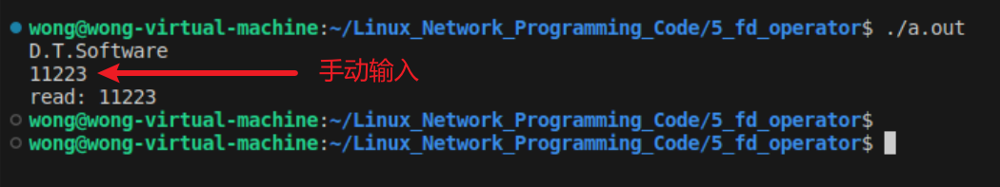
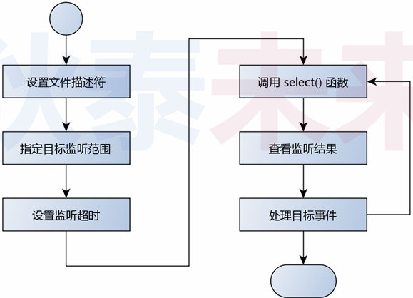
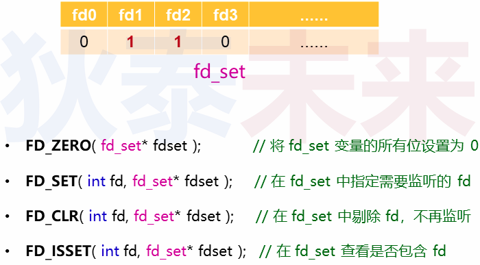
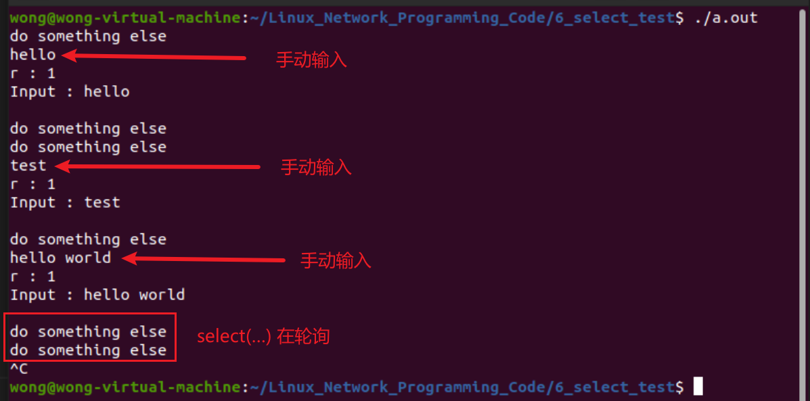

# select多路复用

❓问题 : 如何增强服务端能力,同时支持多个客户端?

## 1.Linux设计哲学 : 一切皆文件

 

### 1.1 Linux 中的文件是什么?

- 狭义：
  - 文件系统中物理意义上的文件 (逻辑上关联的数据集合)
- 广义：
  - 设备 , 管道 , 内存……
  - Linux管理的一切对象

### 1.2 理解文件描述符 ( `File Descriptor` )

- 文件描述符是一个 `非负整数值` , 本质是一个句柄
- **一切对用户程序员透明的资源标识都可以看作句柄**
- 用户使用 `文件描述符` ( 句柄 ) 与内核交互
- 内核通过 `文件描述符` ( 句柄 ) 操作对应资源的数据结构

### 1.3 一切皆文件的意义

- 统一各种设备的操作方式 (open, read, write, close)
- 如 :
  - IO设备 (命令行 , 显示器)
  - 网络设备 (网卡)

### 1.4 Linux文件操作编程模式

 

### 1.5 编程实验

[参考链接](https://github.com/XavierWong-maker/Linux_Network_Programming_Code/blob/master/5_fd_operator/fd_operator.cpp)

```C++
#include <unistd.h>
#include <iostream>

using namespace std;

int main(int argc, char const *argv[])
{
    int iofd {0};

    char s[] {"D.T.Software\n"};

    write(iofd, s, sizeof(s));

    int len (read(iofd, s, 5));

    s[len] = 0;

    cout << "read: " << s << endl;

    return 0;
}
```

 

------

## 2. 事件处理

### 2.1 事件相关函数的分类

- 阻塞式函数
  - 函数调用后需要 **等待** 某个事件发生后才会返回
  - `read(...)` , `scanf(...)` , `accept(...)`

- 非阻塞式函数
  - 函数调用后能够及时返回 (**仅标记等待的事件**)
  - 事件发生后以 **回调方式 传递

### 2.2 阻塞 VS 轮询

- 轮询指依序询问每一个相关设备是否需要服务的方式
- 轮询可用于解决阻塞函数导致程序无法继续执行的问题

 

------

## 3. 关于select(...)

### 3.1 select(...) 函数

- `select(...)` 用于监视指定的文件描述符是否产生事件
- 可通过轮询的方式检测目标事件 (事件产生则标记发生变化)
- 根据事件类型做出具体处理 (如 : 读取数据)

 

>返回值:
>select成功时返回就绪(可读、可写和异常)文件描述符的总数。
>如果在超时时间内没有任何文件描述符就绪,select将返回0。
>select失败时返回-1。
>如果在select等待期间,程序接收到异常信号,则select立即返回-1,并设置errno为EINTR。
>
>
>
>maxfd：参数指定的被监听的文件描述符的总数。
>它通常被设置为 select 监听的所有文件描述符中的最大值+1,因为描述符是从0开始计数的。
>
>
>
>readfds、writefds 和 exceptfds： 指向可读、可写和异常等事件对应的文件描述符集合。
>应用程序调用 select 函数时,通过这 3 个参数传入自己感兴趣的文件描述符。
>
>select 返回时,内核将修改它们来通知应用程序哪些文件描述符已经就绪。
>
>
>
>timeout:
>设置超时时间,如果填入null,则select(...)一直在阻塞

### 3.2 使用步骤

 

### 3.3 相关数据类型及操作

 

### 3.4 轮询示例

 

## 3.5 编程实验

[参考链接](https://github.com/XavierWong-maker/Linux_Network_Programming_Code/blob/master/6_select_test/select.cpp)

```C++
#include <sys/select.h>
#include <sys/time.h>
#include <cstdio>
#include <unistd.h>
#include <iostream>

using namespace std;

int main(int argc, char const *argv[])
{
    int iofd {0};
    char s[] {"hello world\r\n"};
    fd_set reads{};

    FD_ZERO(&reads);
    FD_SET(iofd, &reads);// 將指定文件描述符添加到集合中

    int counter{};

    while (true)
    {
        fd_set temps{reads}; //select函数会影响temps的值,所以每次我们都需要拷贝一次以确保不会出错
        timeval timeout{.tv_sec = 0, .tv_usec = 50000};

        int r {select(1, &temps, nullptr, nullptr, &timeout)};

        if(r > 0){

            cout << "r : " << r << endl;

            int len (read(iofd, &s, (sizeof(s)-1)));

            s[len] = 0;

            cout << "Input : " << s << endl;

        }else if (0 == r){
            usleep(1000);
            if(++counter > 100){
                counter = 0;
                cout << "do something else\n";
            }

        }else{
            break;
        }
    }
    
    return 0;
}
```

 


思考: 使用 `select(...)` 函数可以扩展服务端功能吗 ? 如果可以 , 具体怎么实现 ?