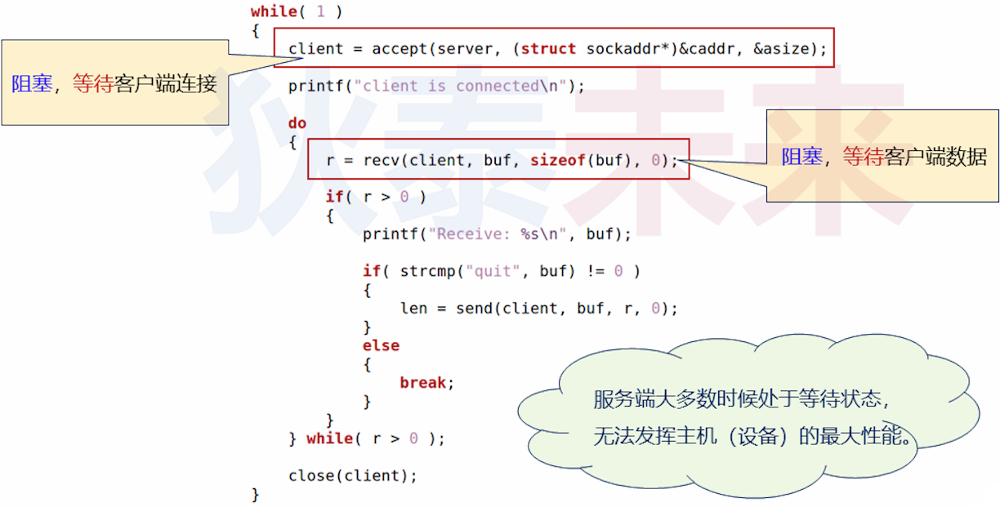
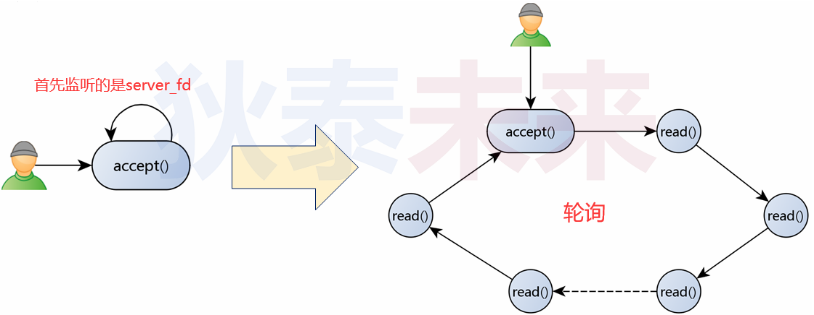
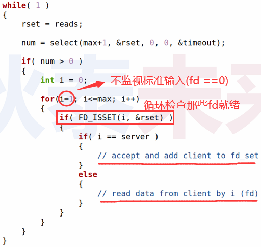
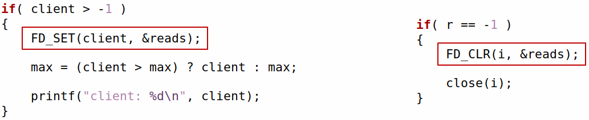
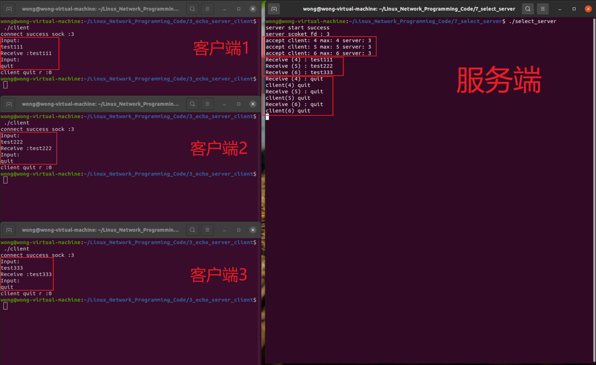

# 多路复用的服务端

❓问题 : 使用 `select(...)` 函数可以扩展服务端功能吗 ? 具体怎么实现 ?

## 1.目前服务端瓶颈分析

 

## 2.解决方案

### 2.1 阻塞变轮询

1. 通过 `select(...)` 函数 **首先监听服务端** `server_fd` , 目标事件为 "连接" (读)
2. 当事件发生 (客户端连接) 则调用 `accept(...)` 接受连接
3. 将 `client_fd` 加入监听范围 , 目标事件为 "数据接收" (读)
4. **循环查看** 各个被监听的文件描述符是否符合有事件发生

### 2.2 实现方式

 

### 2.3 实现逻辑

 

### 2.4 实现关键

- 动态调整需要监视的文件描述符
  - 当接收到客户端连接时 , 将客户端文件描述符加入监听变量 (`fd_set`) 中
  - 当发现客户端断开时 , 在监听变量 (`fd_set`) 中剔除客户端文件描述符
- 保证每个需要监视的文件描述符能够被轮询
- `max = (client > max) ? client : max;`

 

### 2.5 编程实验

[参考链接](https://github.com/XavierWong-maker/Linux_Network_Programming_Code/blob/master/7_select_server/select_server.cpp)

```c++
#include <sys/types.h>
#include <sys/socket.h>
#include <sys/select.h>
#include <netinet/in.h>
#include <arpa/inet.h>
#include <cstdio>
#include <unistd.h>
#include <signal.h>
#include <cstring>
#include <iostream>
#include <functional>

using namespace std;

static function<void(int, siginfo_t*, void*)> func_;

static void signal_handler(const int sig, siginfo_t* info, void*){

    constexpr char str[] {"\nexit\n"};
    write(0, str, sizeof(str));
    if(func_){
        func_(sig, info, nullptr);
    }

    exit(0);
}

int server_handler(int server){

    sockaddr_in addr{};
    socklen_t asize {sizeof(addr)};
    return accept(server, reinterpret_cast<sockaddr*>(&addr), &asize);
}

int client_handler(const int client){

    char buf[32]{};

    int ret ( read(client, buf, (sizeof(buf) - 1)) );

    if(ret > 0){

        buf[ret] = 0;

        cout << "Receive (" << client << ") : " << buf << endl;

        if (strcmp(buf,"quit")){
           
           ret = write(client,reinterpret_cast<const void *>(buf),ret);
       }else{
           ret = -1;
       }
    }

    return ret;
}

int main(int argc, char const *argv[])
{
    const int server {socket(PF_INET,SOCK_STREAM,0)};

    if(-1 == server){
        cout << "server socket error\n";
        return -1;
    }

    func_ = [&](const int sig, siginfo_t* info, void*){
        close(server);
    };

    struct sigaction act{};
    act.sa_flags = SA_RESTART | SA_SIGINFO;
    act.sa_sigaction = signal_handler;

    sigaction(SIGINT, &act, nullptr);

    sockaddr_in saddr{};
    saddr.sin_family = AF_INET;
    saddr.sin_addr.s_addr = htonl(INADDR_ANY);
    saddr.sin_port = htons(8888);

    if(-1 == bind(server, reinterpret_cast<const sockaddr*>(&saddr), sizeof(saddr))){
        cout << "server bind error\n";
        return -1;
    }

    if(-1 == listen(server, 1)){
        cout << "server listen error\n";
        return -1;
    }

    cout << "server start success\n" << "server scoket_fd : " << server << endl;

    int max{server};
    fd_set reads{};

    FD_ZERO(&reads);
    FD_SET(server, &reads);

    while (true)
    {
        fd_set temps {reads};

        timeval timeout{.tv_sec = 0, .tv_usec = 10000};

        int num{ select((max + 1), &temps, nullptr, nullptr, &timeout)};

        if(num > 0){
            for(int i {server}; i <= max; i++){
                if(FD_ISSET(i, &temps)){
                    if(i == server){

                        const int client {server_handler(server)};

                        if(client > -1){

                            FD_SET(client, &reads);

                            max = (client > max)? client : max;

                            cout << "accept client: " << client << 
                                    " max: " << max << 
                                    " server: " << server << endl;
                        }

                    }else{
                        
                        const int r {client_handler(i)};

                        if(-1 == r){
                            
                            FD_CLR(i, &reads);
                            close(i);
                            cout << "client(" << i << ") quit\n";
                        }
                    }
                }
            }
        }
    }
    
    close(server);

    return 0;
}
```




思考 : 改进后的服务端是否还有优化的空间? `select(...)` 是Linux系统特有的吗?