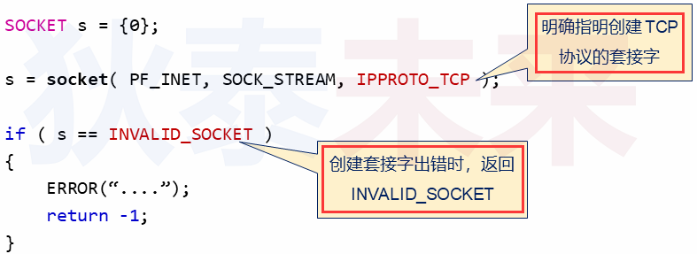
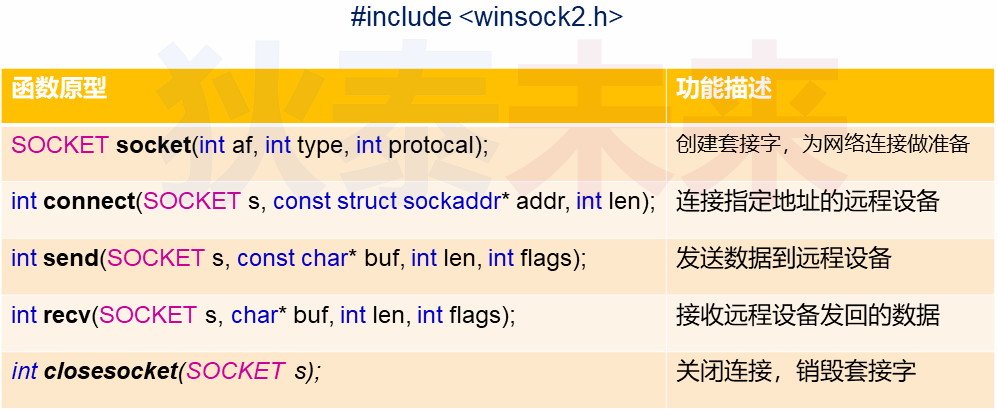
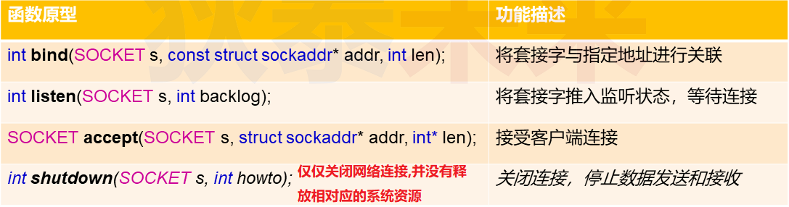
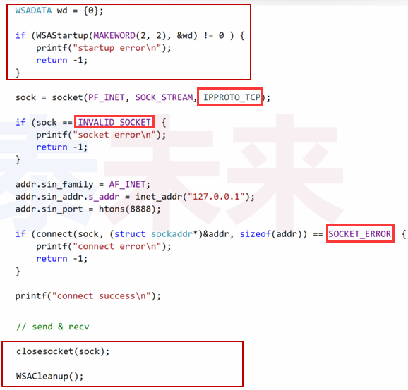
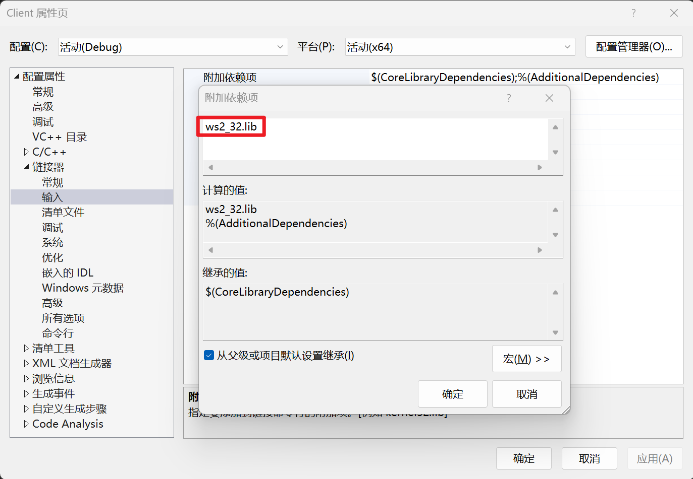
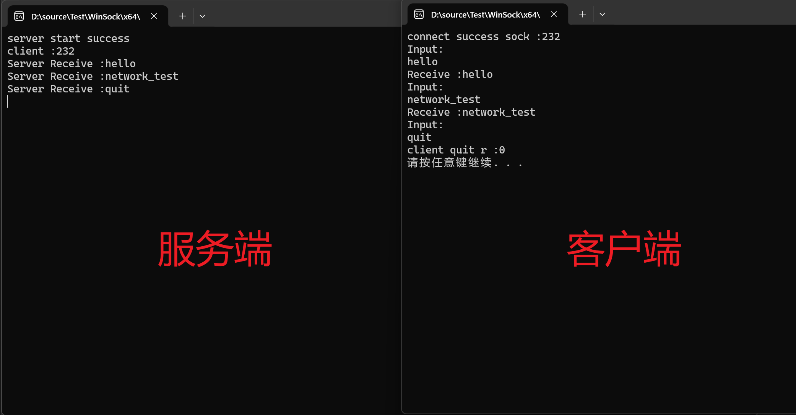
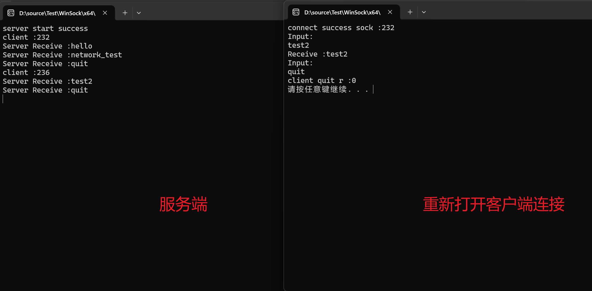
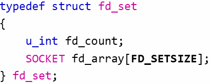
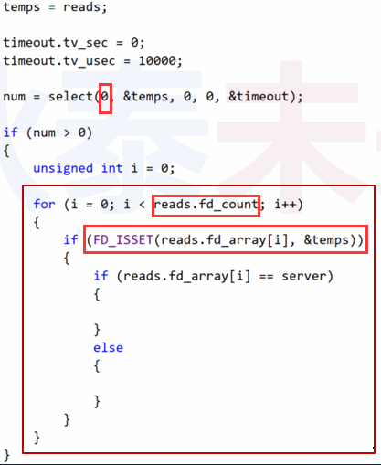
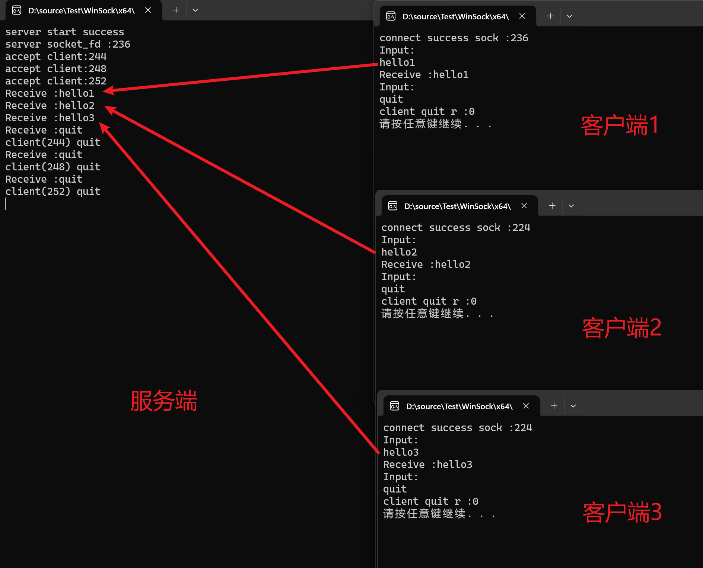

# Windows 网络编程

## 1.Windows 下的socket(…)

### 1.1 socket 接口已普遍存在于现代操作系统中

- Windows下的 **socket(...)** 编程接口与 Linux 中几乎相同
- 不同之处
  - 返回值类型不同 (`句柄类型`)
  - `句柄` 不是文件描述符 , `Windows中并不是一切皆文件`

### 1.2 Windows下 socket(...) 的用法

 

### 1.3 Windows网络编程接口

 

 

### 1.4 几点微细差异

- 通过 **WSAStartup(...)** 初始化系统环境 (最先调用)
- **socket(...)** , **accept(...)** 错误返回 `INVALID_SOCKET` (不可默认为-1)
- **bind(...)** , **listen(...)** 错误返回 `SOCKET_ERROR` (不可默认为-1)
- **connect(...)** , **send(...)** , **recv(...)** 错误返回 `SOCKET_ERROR` (不可默认为-1)
- 通过 **WSACleanup()** 清除系统环境 (最后调用)

### 1.5 Windows 网络编程的特殊说明

- 在工程属性设置链接 **ws2_32.lib**
- 定义变量 **WSADATA wd** ;
- 选择 socket 版本并初始化 **WSAStartup (MAKEWORD(2,2) , &wd)** ;
- Windows版本存在多个 socket 版本
  - **MAKEWORD(1 , 2)** //主版本为1 , 副版本为2 , 返回 0x0201
  - **MAKEWORD(2 , 2)** //主版本为2 , 副版本为2 , 返回 0x0202

### 1.6 Windows 客户端编程示例

 

### 1.7 Windows 服务端编程示例

 

### 1.8 编程实验

[参考链接](https://github.com/XavierWong-maker/Linux_Network_Programming_Code/tree/master/8_WinSock)

服务端与客户端都需要加入ws2_32.lib

 

#### 1.8.1 客户端

```C++
#include <iostream>
#include <WinSock2.h>

//需在工程设置链接器(linker)输入选项添加ws2_32.lib

using namespace std;

int main(int argc, char* argv[])
{
    WSADATA wd{};

    if (WSAStartup(MAKEWORD(2, 2), &wd)) {
        cout << "startup error\n";
        return -1;
    }

    SOCKET sock{ socket(PF_INET,SOCK_STREAM,IPPROTO_TCP) };

    if (INVALID_SOCKET == sock) {
        cout << "socket error\n";
        return -1;
    }

    sockaddr_in addr{};
    addr.sin_family = AF_INET;
    addr.sin_addr.s_addr = inet_addr("127.0.0.1");
    addr.sin_port = htons(8888);

    if (SOCKET_ERROR == connect(sock, reinterpret_cast<const sockaddr*>(&addr), sizeof(addr))) {
        cout << "connect error\n";
        return -1;
    }

    cout << "connect success sock :" << sock << '\n';

    for (;;) {

        char input[32]{}, buf[128]{};

        cout << "Input: \n";

        cin >> input;

        int len(send(sock, input, strlen(input) + 1, 0));

        int r(recv(sock, buf, sizeof(buf), 0));

        if (r > 0) {
            cout << "Receive :" << buf << '\n';
        }
        else {
            cout << "client quit r :" << r << '\n';
            break;
        }
    }

    closesocket(sock);

    WSACleanup();

    system("pause");

    return 0;
}
```

#### 1.8.2 服务端

```C++
#include <iostream>
#include <WinSock2.h>

//需在工程设置链接器(linker)输入选项添加ws2_32.lib

using namespace std;

int main(int argc, char* argv[])
{
    WSADATA wd{};

    if (WSAStartup(MAKEWORD(2, 2), &wd)) {
        cout << "startup error\n";
        return -1;
    }

    SOCKET server{ socket(PF_INET,SOCK_STREAM,IPPROTO_TCP) };

    if (INVALID_SOCKET == server) {
        cout << "server socket error\n";
        return -1;
    }

    sockaddr_in saddr{};
    saddr.sin_family = AF_INET;
    saddr.sin_addr.s_addr = htonl(INADDR_ANY);//htonl函数把小端转换成大端（网络字节序采用大端）
    saddr.sin_port = htons(8888);

    if (SOCKET_ERROR == bind(server, reinterpret_cast<const sockaddr*>(&saddr), sizeof(saddr))) {
        cout << "server bind error\n";
        return -1;
    }

    if (SOCKET_ERROR == listen(server, 1)) {
        cout << "server listen error\n";
        return -1;
    }

    cout << "server start success\n";

    for (;;) {

        sockaddr_in caddr{};
        int asize{ sizeof(caddr) };

        SOCKET client{ accept(server,reinterpret_cast<sockaddr*>(&caddr),&asize) };

        if (INVALID_SOCKET == client) {
            cout << "client accept success\n";
            return -1;
        }

        cout << "client :" << client << '\n'; //client的数值表示系统资源的id

        int r{}, len{};

        do {
            char buf[32]{};

            r = recv(client, buf, (sizeof(buf) / sizeof(char)), 0);

            if (r > 0) {

                cout << "Server Receive :" << buf << '\n';

                if (strcmp(buf, "quit")) {

                    len = send(client, buf, r, 0);
                }
                else {
                    break;
                }
            }

        } while (r > 0);

        closesocket(client);
    }

    closesocket(server);

    WSACleanup();

    return 0;
}
```

#### 1.8.3 实验结果

 

 


❓问题 : select(...) 是Linux系统特有的吗?

------

## 2.Windows下的 select(...)

### 2.1 Windows 中的 select(...)

- Windows 中同样提供 **select(...)** 函数 , 且`参数`与Linux的版本`完全相同`

- 注意 : Windows 中的 **select(...)** 函数 , `第一个参数没有任何意义（仅为了兼容）`

 

### 2.2 一个细微的差异

Windows 中的 **select(...)** 专门为套接字而设计

- `fd_count` 用于记录感兴趣的 socket 数量
- `fd_array` 用于记录感兴趣的 socket 句柄值

 

### 2.3 Windows 中 select(...) 函数使用示例

Windows官方推荐的使用方法

 

### 2.4 编程实验

[参考链接](https://github.com/XavierWong-maker/Linux_Network_Programming_Code/tree/master/9_Win_Select_Server)

```C++
#include <iostream>
#include <WinSock2.h>

//需在工程设置链接器(linker)输入选项添加ws2_32.lib

using namespace std;

SOCKET server_handler(const SOCKET server)
{
    sockaddr_in addr{};
    int asize{ sizeof(addr) };
    return accept(server, reinterpret_cast<sockaddr*>(&addr), &asize);
}

int client_handler(const SOCKET client)
{
    char buf[32]{};

    int ret{ recv(client, buf, (sizeof(buf) - 1), 0) };

    if (ret > 0) {

        buf[ret] = 0;

        cout << "Receive :" << buf << endl;

        if (strcmp(buf, "quit")) {

            ret = send(client, buf, ret, 0);
        }
        else {
            ret = -1;
        }
    }

    return ret;
}

int main()
{
    WSADATA wd{};

    if (WSAStartup(MAKEWORD(2, 2), &wd)) {
        cout << "startup error\n";
        return -1;
    }

    const SOCKET server{ socket(PF_INET,SOCK_STREAM,IPPROTO_TCP) };

    if (INVALID_SOCKET == server) {
        cout << "server socket error\n";
        return -1;
    }

    sockaddr_in saddr{};
    saddr.sin_family = AF_INET;
    saddr.sin_addr.s_addr = htonl(INADDR_ANY);//htonl函数把小端转换成大端（网络字节序采用大端）
    saddr.sin_port = htons(8888);

    if (SOCKET_ERROR == bind(server, reinterpret_cast<const sockaddr*>(&saddr), sizeof(saddr))) {
        cout << "server bind error\n";
        return -1;
    }

    if (SOCKET_ERROR == listen(server, 1)) {
        cout << "server listen error\n";
        return -1;
    }

    cout << "server start success\n" << "server socket_fd :" << server << '\n';

    fd_set reads{};

    FD_ZERO(&reads);
    FD_SET(server, &reads);

    for (;;) {

        fd_set temps{ reads };

        timeval timeout{ 0, 10000 };

        int num{ select(0 ,&temps, nullptr, nullptr, &timeout) };

        if (num > 0) {

            for (uint32_t i{ }; i < reads.fd_count; i++) {

                const SOCKET sock{ reads.fd_array[i] };

                if (FD_ISSET(sock, &temps)) {

                    if (sock == server) {

                        const SOCKET client{ server_handler(sock) };

                        if (INVALID_SOCKET != client) {

                            FD_SET(client, &reads);
                            cout << "accept client:" << client << endl;
                        }
                    }
                    else {

                        const int r{ client_handler(sock) };

                        if (-1 == r) {

                            FD_CLR(sock, &reads);
                            cout << "client(" << sock << ") quit\n";
                            closesocket(sock);
                        }
                    }
                }
            }
        }
    }
    closesocket(server);
    WSACleanup();
    return 0;
}
```

 


❓思考 : 如何编写可以跨平台编译运行的网络程序?