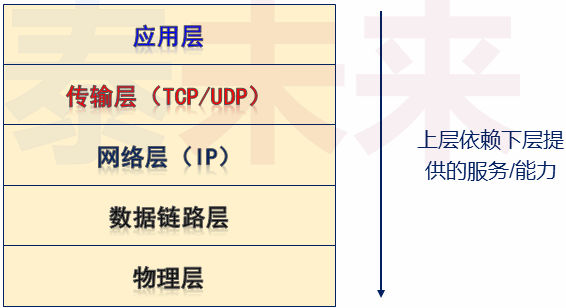
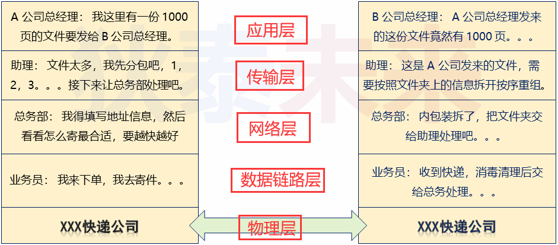
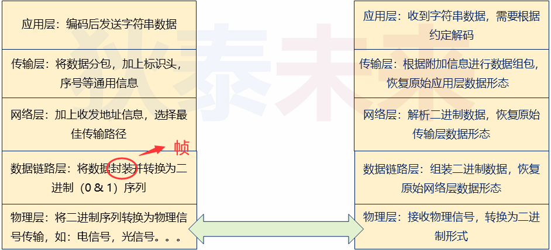
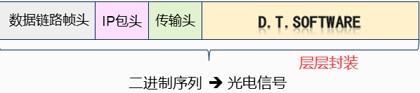
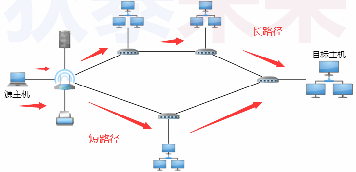
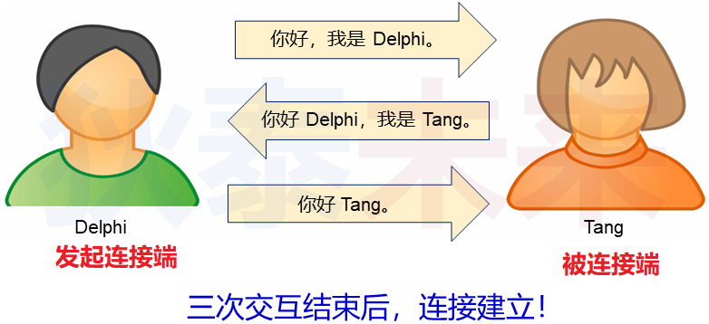
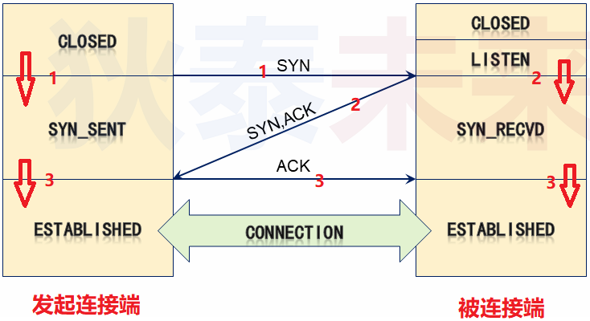
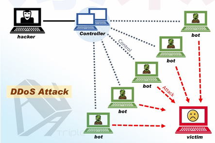
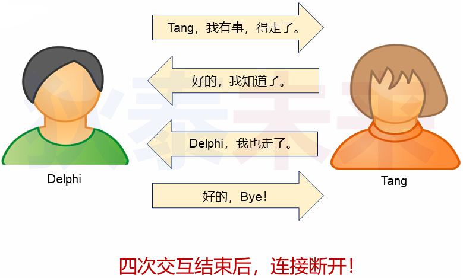
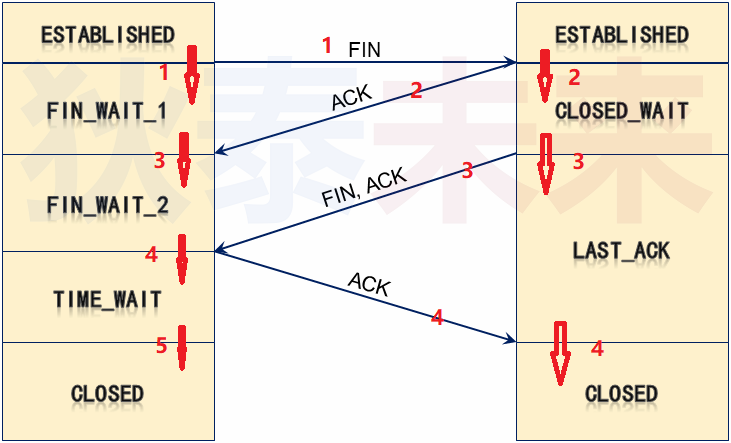

# TCP与UDP

## 1. TCP

### 1.1 TCP/IP 分层结构

 

TCP/IP (协议栈) 协议族

- 应用层 : 各个应用程序可以定义 (使用) 各种各样的协议
- 传输层 (TCP/UDP) : 确保发出的数据能够达到目标主机 , 完成数据传输
- 网络层 (IP) : 填写数据包地址 , 选择数据传递路径
- 数据链路层 : 融合不同连接方式的链路 , 屏蔽网络差异
- 物理层 : 具体连接方式 : 有线 , 无线 , 光纤 , ...

### 1.2 TCP/IP 工作方式

一个生活小例子

 

 

|             |                         |             |
| ----------- | ----------------------- | ----------- |
| A           |                         | B           |
| 应用层:     |                         | 应用层:     |
| 传输层:     |                         | 传输层:     |
| 网络层:     |                         | 网络层:     |
| 数据链路层: |                         | 数据链路层: |
| 物理层:     |                         | 物理层:     |
|             | <---------------------> |             |

### 1.3 TCP/IP 层次结构特点

- 上层 `依赖邻接` 下层的能力 , 下层只为 `直接邻接` 上层服务

- 上层不知道下层工作机制 , 下层不管上层传输的数据内容

- 不做跨层服务 , 层次结构的角色缺一不可

 

### 1.4 深入理解网络层 (IP层)

- IP寻址 : IP地址属于网络层地址 , 用于标识网络上的主机
- 路由控制 : 控制数据如何到达目标主机 (如 : 需要经过那些路由器转发)
- 无连接 : 数据包根据IP地址在网络上传递 (无需与目标实现建立连接)
- <u>MAC地址</u> :
  - **数据链路层所使用的硬件地址**
  - **地址与网络无关，出厂时写入到网络设备中**

>当主机从网络上每收到一个数据帧时，首先检查数据帧中的MAC地址。
>如果是发往本地的数据帧则收下，之后进行其他处理;否则就将此帧丢弃，不再进行其他的处理

### 1.5 IP地址和MAC地址

- `IP地址是动态的` , 不特定于某个具体的硬件 (MAC 地址隶属于具体硬件)
- IP地址是网络层使用的地址 (用于跨网络投递数据包)
- `MAC地址是数据链路层使用的地址` (用于确定目标网络中接收数据的主机)
- 路由器中记录了本网络中主机 IP 地址与 MAC 地址的映射关系

### 1.6 IP路由控制

- 为了将数据发送给目标主机 , 所有主机都维护者一张**路由表**
  - 路由表的获取的方式 : 手动填写 , 动态创建(大多数路由器默认行为)
- 路由表记录了IP数据包下一步应该发给哪个路由器

 

### 1.7 IP数据转发

- IP数据包转发用的是 “尽力服务” 策略
  - “尽力服务” 指 “努力 , 但不保证结果”
  - 转发时会通知附加信息检查数据合法性 , 但出现异常不会进行重发
  - 以包为单位进行转发 , 不保证到达 (发出之后 , 石沉网海)

❓问题 : TCP / IP 网络层次结构是否能提供可靠数据传输 ?

### 1.8 传输控制协议 (Transmission Control Protocol)

- TCP 在协议实现上提供可靠数据传输
  - TCP 不存在 "数据包" 的概念 , `实现了流式传输` ( 数据如流水 , `无头无尾` )
  - TCP内部有服务状态 , `能够精确知道数据是否已经发送成功` , 是否被接收 , ...
  - TCP在行为上可进行阻塞控制 (网络环境差时,能够调整数据发送速度)

### 1.9 TCP 连接与断开

#### 1.9.1 TCP 连接

问题 : 为什么TCP建立连接需要3次握手?

防止失效的连接请求报文段被服务端接收 , 从而产生错误

 

 

#### 1.9.2 TCP天生缺陷 (DDoS攻击)

- 客服端收到 SYN,ACK 之后 , 不再回复最后的 ACK 消息。
- 这将导致服务端消耗资源 , 但并不会实际进行通信。
- 当多个傀儡客户端同时对服务端进行 "连接请求", 服务端资源将耗尽。

 

#### 1.9.3 TCP 连接断开

 

 

------

## 2.UDP

### 2.1 UDP的特点

- 完全继承网络层工作方式
  - 无需连接 , 直接指定 IP地址和端口即可发送数据
  - 监听固定端口 , 只要有数据 , 统统接收
  - 不管网络情况 , 只要是数据统统可发送
  - 不关心数据是否到达对端

### 2.2 UDP使用场合

- 对数据不敏感 , 需要实时性的场合 (如 : 直播 , 实时游戏)
- 网络环境比较好的场合 (如 : 物联网家居)
- 需要深度定制协议的场合 (如 : "不丢包的" UDP协议)

### 2.3 TCP 与 UDP的区别

TCP和UDP是两种网络传输协议 , 它们在很多方面都有所不同。下面是它们的主要区别 :

1. 连接性：TCP是面向连接的协议 , 而UDP是无连接的协议。

   这意味着使用TCP协议进行通信时 , 必须在通信双方建立连接后才能开始数据传输。而使用UDP协议进行通信时，通信双方之间没有建立连接的过程 , 数据可以直接发送。

2. 可靠性 : TCP是一种可靠的协议 , 它提供了数据传输的确认和重传机制 , 确保数据能够完整无误地传输。而UDP是一种不可靠的协议 , 它不提供数据传输的确认和重传机制，数据传输过程中可能会出现丢失或重复的情况。

3. 速度 : UDP比TCP快，因为它没有连接建立和确认的过程 , 数据可以直接发送。而TCP的连接建立和确认过程会消耗一定的时间。

4. 传输方式 : TCP是一种面向字节流的协议 , 它会将数据拆分成若干个数据包进行传输。而UDP是一种面向报文的协议 , 它会将整个数据报文作为一个数据包进行传输。

5. 适用场景 : TCP适用于需要可靠传输和顺序传输的应用场景 , 如文件传输、电子邮件等。而UDP适用于实时传输和不需要可靠传输的应用场景 , 如音视频传输、在线游戏等。

总的来说 , TCP和UDP都有各自的优缺点 , 选择哪种协议取决于具体的应用场景和需求。

 

