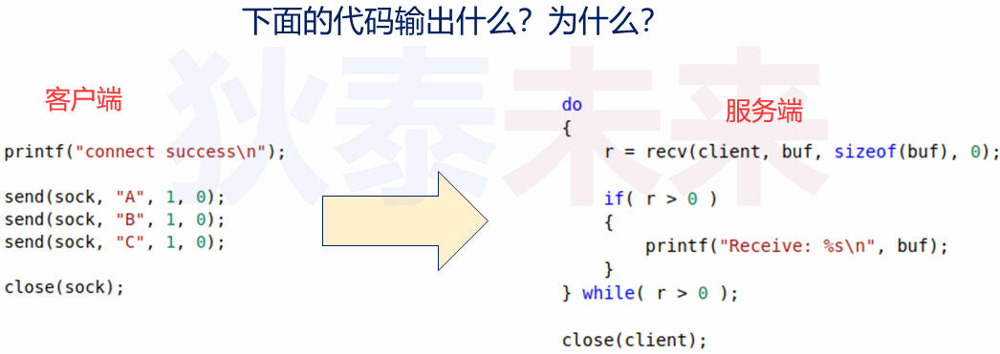
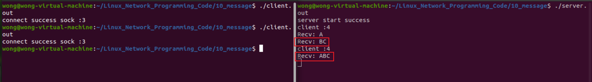
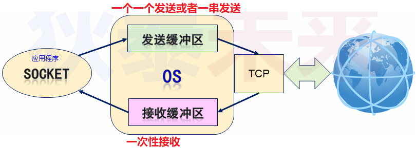
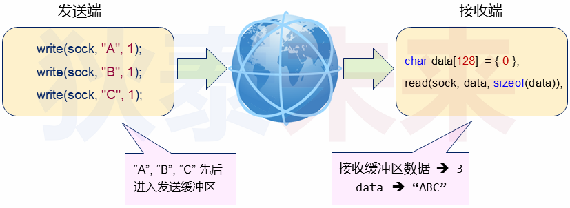
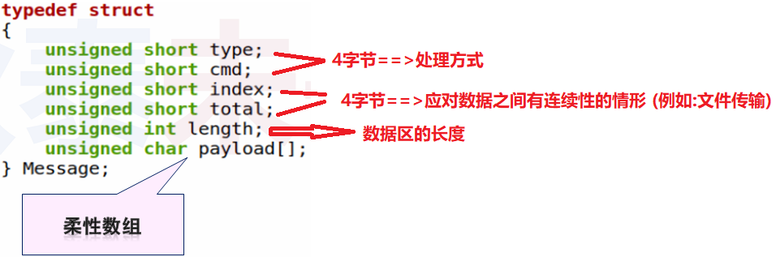
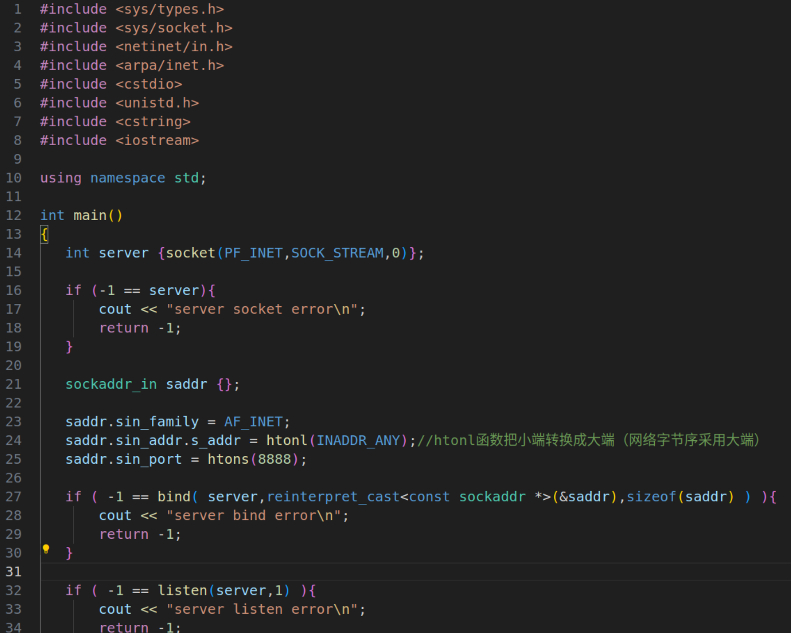
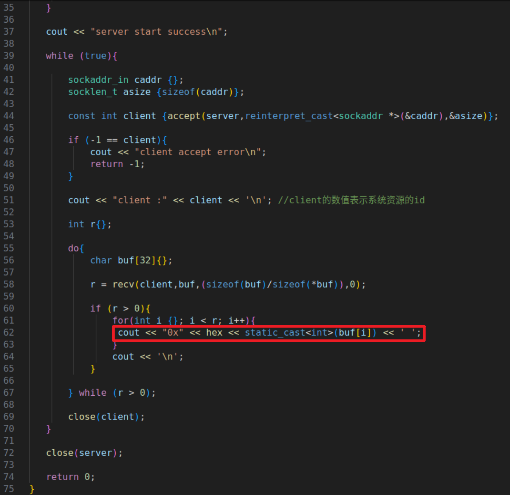
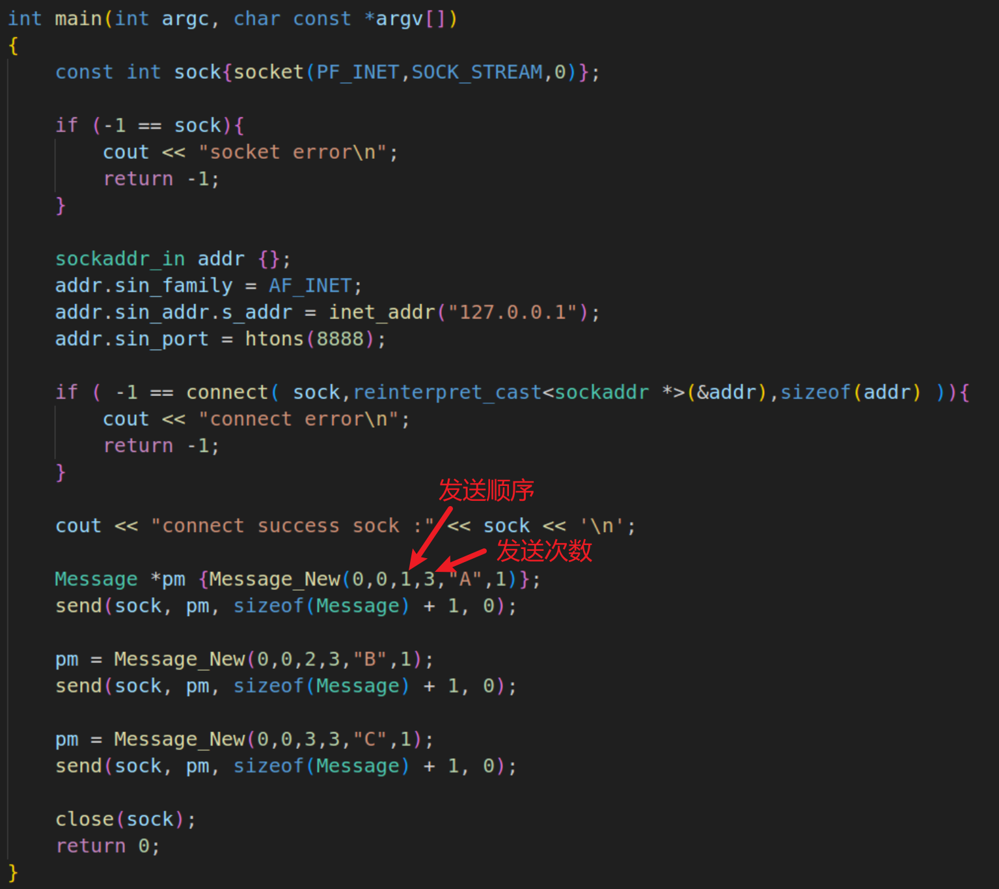
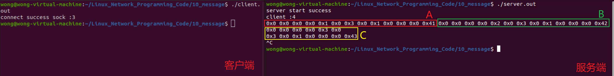

# 应用层协议设计与实现

## 0.抛砖引玉

❓问题 : 下面的代码输出什么 ? 为什么 ?

 

**编程实验 :**


- server

```C++
#include <sys/types.h>
#include <sys/socket.h>
#include <netinet/in.h>
#include <arpa/inet.h>
#include <cstdio>
#include <unistd.h>
#include <cstring>
#include <iostream>

using namespace std;

int main() 
{
   int server {socket(PF_INET,SOCK_STREAM,0)};

   if (-1 == server){
       cout << "server socket error\n";
       return -1;
   }

   sockaddr_in saddr {};

   saddr.sin_family = AF_INET;
   saddr.sin_addr.s_addr = htonl(INADDR_ANY);//htonl函数把小端转换成大端（网络字节序采用大端）
   saddr.sin_port = htons(8888);

   if ( -1 == bind( server,reinterpret_cast<const sockaddr *>(&saddr),sizeof(saddr) ) ){
       cout << "server bind error\n";
       return -1;
   }

   if ( -1 == listen(server,1) ){
       cout << "server listen error\n";
       return -1;
   }

   cout << "server start success\n";

   while (true){

       sockaddr_in caddr {};
       socklen_t asize {sizeof(caddr)};

       const int client {accept(server,reinterpret_cast<sockaddr *>(&caddr),&asize)};

       if (-1 == client){
           cout << "client accept error\n";
           return -1;
       }

       cout << "client :" << client << '\n'; //client的数值表示系统资源的id

       int r{};

       do{
           char buf[32]{};

           r = recv(client,buf,(sizeof(buf)/sizeof(*buf)),0);

           if (r > 0){
               cout << "Recv: " << buf << '\n';
           }

       } while (r > 0);

       close(client);
   }

   close(server);

   return 0;
}
```

- client

```c++
#include <sys/types.h>
#include <sys/socket.h>
#include <netinet/in.h>
#include <arpa/inet.h>
#include <cstdio>
#include <unistd.h>
#include <cstring>
#include <iostream>

using namespace std;

int main(int argc, char const *argv[])
{
    const int sock{socket(PF_INET,SOCK_STREAM,0)};

    if (-1 == sock){
        cout << "socket error\n";
        return -1;
    }

    sockaddr_in addr {};
    addr.sin_family = AF_INET;
    addr.sin_addr.s_addr = inet_addr("127.0.0.1");
    addr.sin_port = htons(8888);

    if ( -1 == connect( sock,reinterpret_cast<sockaddr *>(&addr),sizeof(addr) )){
        cout << "connect error\n";
        return -1;
    }

    cout << "connect success sock :" << sock << '\n';

    send(sock,"A",1,0);
    send(sock,"B",1,0);
    send(sock,"C",1,0);

    close(sock);
    return 0;
}
```

 

>出现这个问题,由于TCP是流式数据,无头无尾,发送和接收不对等,从而导致数据粘包问题

- 小知识 :
  - **发送缓冲区** :
    - 数据先进入发送缓冲区,之后由操作系统发送远端主机
  - **接收缓冲区**:
    - 远端数据被操作系统接收后放入接收缓冲区
    - 之后应用程序从接收缓冲区读取数据

 

------

## 1. TCP 应用编程中的 "问题"

- 接收端无法知道数据的发送方式
- 接收端无法知道 "ABC" 是分开3次进行发送

 

### 1.1 网络编程中的期望

- 每次发送一条 `完整的` 消息 , 每次接收一条 `完整的` 消息
- 即使接收缓冲区中有多条消息 , `也不会出现消息粘连`
- 消息中涵盖了 `数据类型` 和 `数据长度` 等信息

------

## 2.应用层协议的设计

### 2.1 什么是协议?

- 协议是通信双方为数据交换而建立的 `规则` 、`标准` 或 `约定` 的集合

### 2.2 协议对数据的传输作用

- 通信双方根据协议 `能够正确收发数据`
- 通信双方根据协议 `能够解释数据的意义`

### 2.3 协议设计示例

- 目标 : `设计可用于数据传输的协议`
- 完整消息包含 :
  - 数据头 : 数据类型(type) (即 : 数据区用途 , 固定长度)
  - 数据长度 : 数据区长度(length) (固定长度)
  - 数据区 : 字节数据(data) (变长区域)

 

- 消息字至少 12 个字节 ( 消息头 + 数据长度 )
- 通过计算消息的长度，能够避开数据粘连的问题

 

### 2.4 编程实验

[参考链接](https://github.com/XavierWong-maker/Linux_Network_Programming_Code/tree/master/10_message)

#### 2.4.1 消息协议部分

```C++
/*message.h*/
#ifndef MESSAGE_H
#define MESSAGE_H

struct Message
{
    unsigned short type,cmd,index,total;
    unsigned int length;
    unsigned char payload[];
};

Message * Message_New(unsigned short type,
                    unsigned short cmd,
                    unsigned short index,
                    unsigned short total,
                    const char * payload,
                    unsigned int length);

#endif  // MESSAGE_H
```

```C++
/*message.cpp*/
#include "message.h"
#include <stdlib.h>
#include <string.h>

Message * Message_New(unsigned short type,unsigned short cmd,unsigned short index,
                    unsigned short total,const char * payload,unsigned int length)
{
    Message * ret {reinterpret_cast<Message*>(malloc(sizeof(Message)+length))};

    if(ret){
        ret->type = type;
        ret->cmd = cmd;
        ret->index = index;
        ret->total = total;
        ret->length = length;

        if(payload){
            memcpy(ret + 1, payload, length);
            /* (ret+1) 是跳到柔性数组指针*/
        }
    }

    return ret;
}
```

#### 2.4.2 测试部分

 

 


**客户端：**

 



>❓思考 : 如何在代码层面封装协议细节 (仅关心消息本身) ?